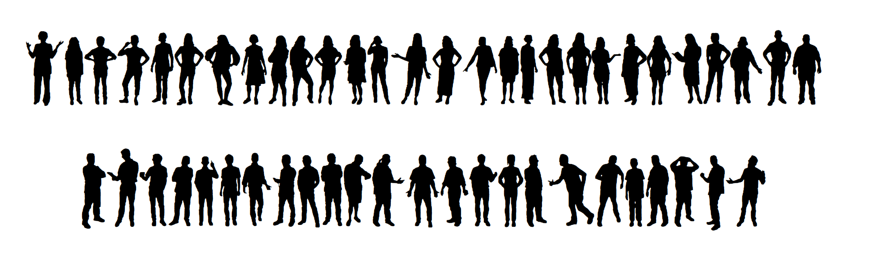

# Wee People

A typeface of people sillhouettes, to make it easy to build web graphics featuring little people instead of dots.

Illustrations by Alberto Cairo.

Made using [Glyphs Mini](https://glyphsapp.com/glyphs-mini).

Font in use:

[What Happened to All the Jobs Trump Promised?](https://projects.propublica.org/graphics/trump-job-promises)

