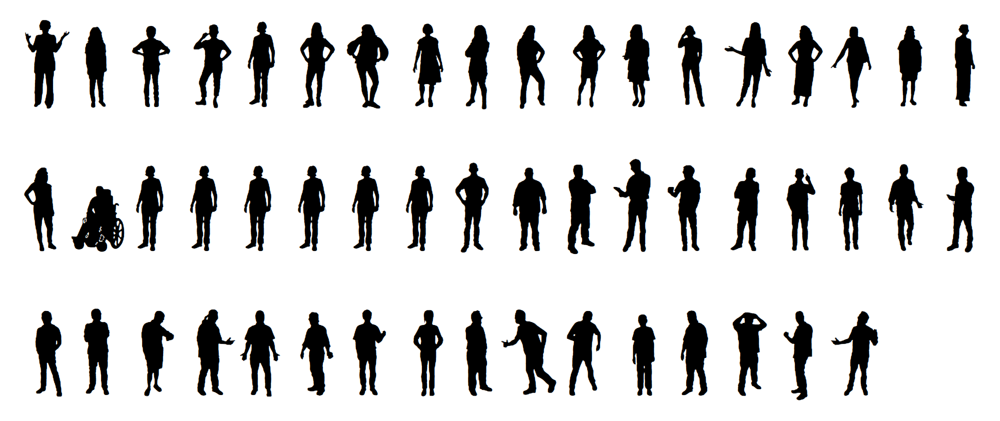

# Wee People

A typeface of people sillhouettes, to make it easy to build web graphics featuring little people instead of dots.

Illustrations by Alberto Cairo.

Made using [Glyphs Mini](https://glyphsapp.com/glyphs-mini).

### How to use: 

Just add the contents of "weepeople.css" to your page, or link to that CSS file. [Here's a demo.](http://propublica.github.io/weepeople/)

### Article:

[Our Font Is Made of People](https://source.opennews.org/articles/our-font-made-people/)

### Font in use:

[What Happened to All the Jobs Trump Promised?](https://projects.propublica.org/graphics/trump-job-promises)

### License:

You can use this font for free if you follow the rules: 

1. If you use Wee People you have to credit us.
2. Wee People can't be sold separately. It’s okay to use it on pages with ads, or as a design element in a publication for which money is charged.
3. You can’t alter the shapes in Wee People or add new shapes without our approval.

This work is licensed under the Creative Commons Attribution-NonCommercial-NoDerivs 3.0 United States License. To view a copy of this license, visit [http://creativecommons.org/licenses/by-nc-nd/3.0/us/](http://creativecommons.org/licenses/by-nc-nd/3.0/us/) or send a letter to Creative Commons, 444 Castro Street, Suite 900, Mountain View, California, 94041, USA.

